# opencode-review-dashboard

[English] | [中文](README.zh-CN.md)

A browser-based code review tool for [OpenCode](https://opencode.ai). Review diffs in your browser, leave comments, mark findings, then have an AI agent apply the fixes — all without leaving your editor.

If you review pull requests or diffs on a regular basis, this saves you the back-and-forth of copy-pasting comments into GitHub.

---

## What it looks like

### Browse the diff

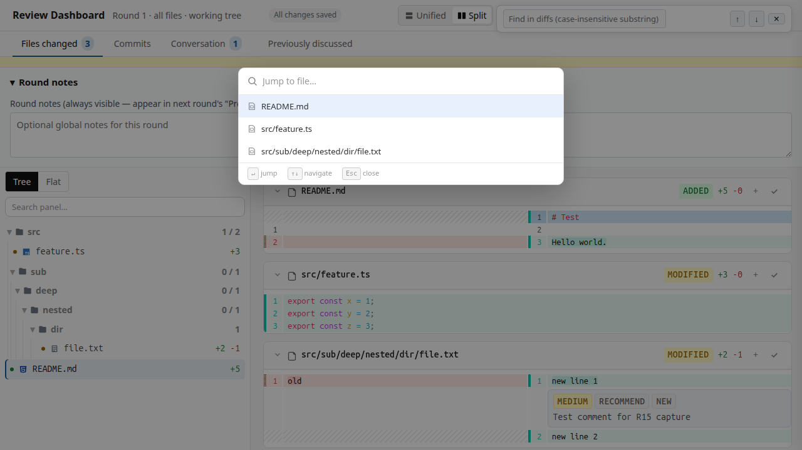

*Files with changes are highlighted. Files you haven't touched appear dimmed.*

### Hide whitespace noise

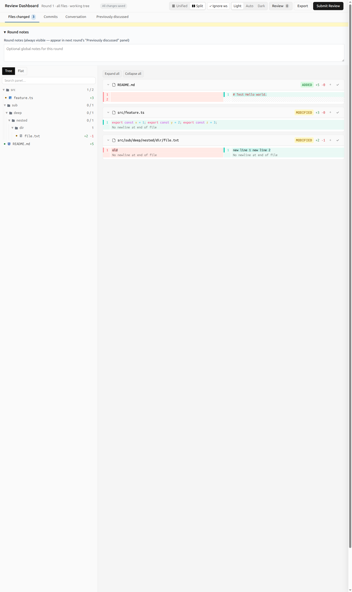

*Click `Ignore ws` in the toolbar to collapse consecutive whitespace and trim trailing space. Pure reformatting (tab↔space, indent width) disappears from the diff. Stays on across reloads.*

### Expand or collapse everything

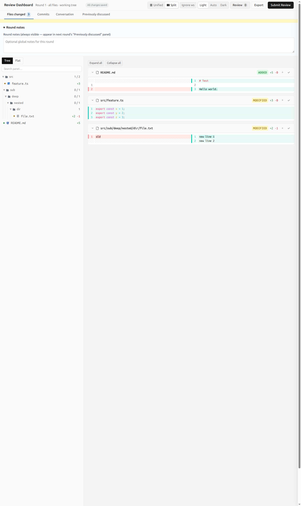

*Two buttons at the top of the diff panel flip every file's collapsed-context setting at once. Useful for skimming a 30-file diff vs. reviewing line-by-line.*

### Add findings and react with emoji

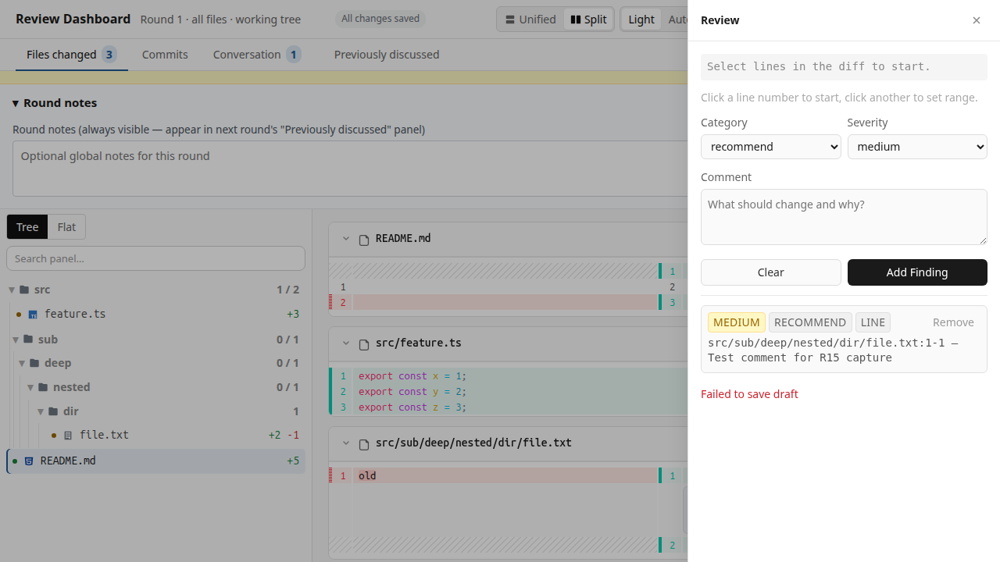

*Click any line number to add a finding. One-click reactions for quick feedback.*

### Copy a finding as Markdown


*One click drops a self-contained Markdown snippet (round tag, file:line permalink, comment, audit count, reactions) onto your clipboard. Paste straight into a PR comment, Slack thread, or Notion doc.*

### Filter and sort the conversation

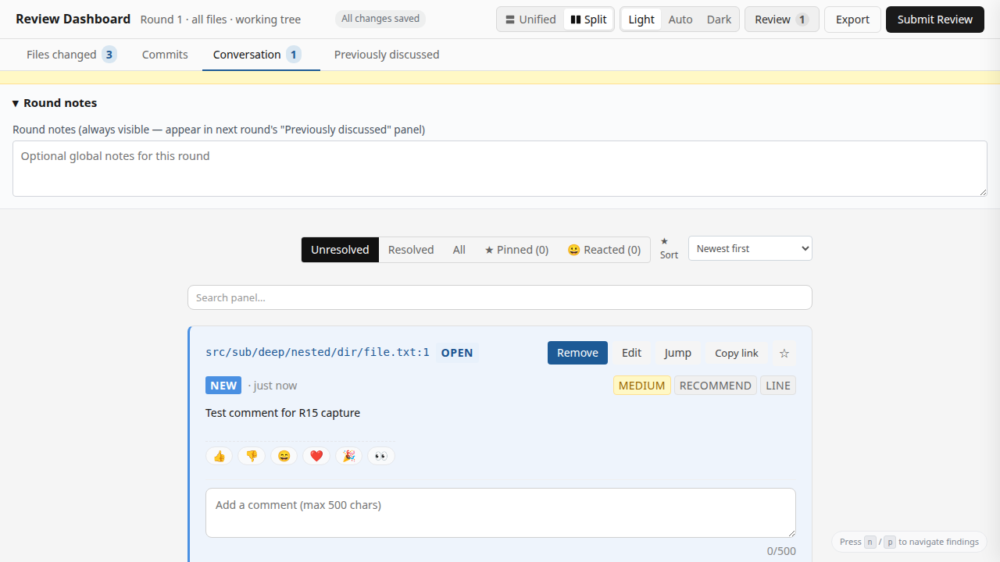

*Pin findings to revisit them in the next round. Sort by severity to prioritize.*

### Search inside the diff

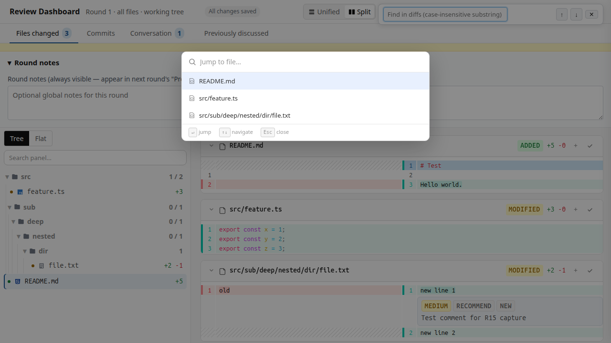

*`Ctrl+F` (or `Cmd+F`) to find any text in the loaded diff.*

### Submit with confidence

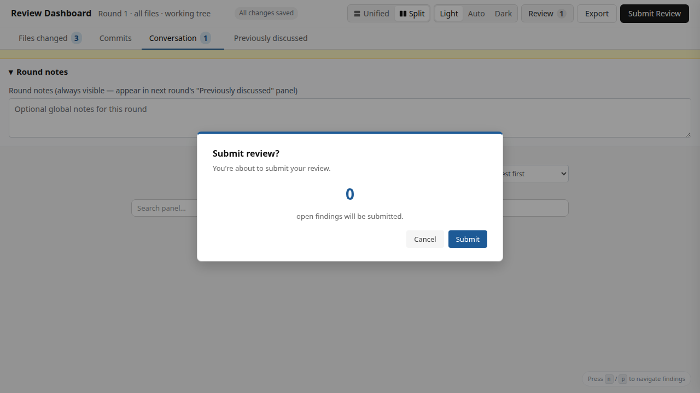

*A confirmation step before final submit so you don't lose work accidentally.*

### Round notes inside the submit modal

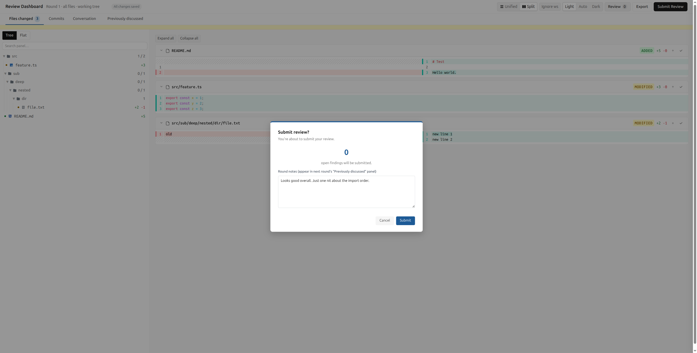

*Round notes moved into the Submit Review modal so you write the summary at the moment you're ready to send. Auto-saves to the same draft as your findings.*

### Switch languages (English / Chinese)

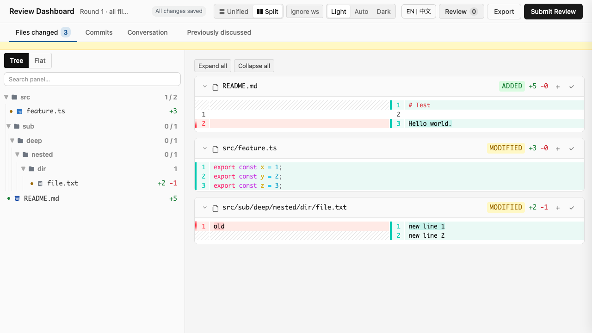

*Click the language toggle in the toolbar to switch between English and Chinese. Your choice persists across reloads via localStorage. Toolbar buttons, sidebar tabs, and modal text update reactively.*

### Toast notifications for your actions

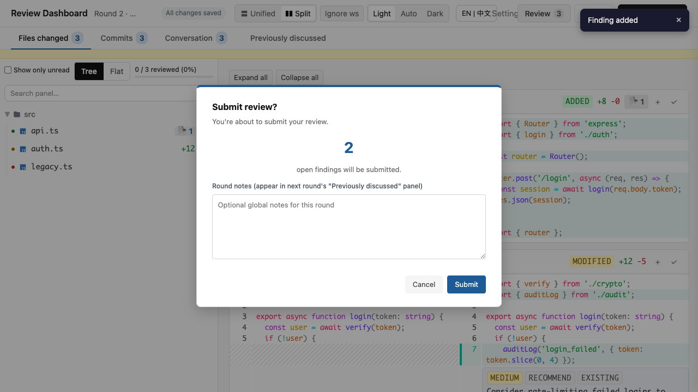

*Brief 3-second confirmation toasts appear in the top-right when you copy a permalink, copy a finding as Markdown, add a finding, or submit a review. Screen readers announce them via `aria-live="polite"`. Replaces the R14-era intrusive toast with a non-blocking alternative.*

### Better keyboard and screen-reader accessibility

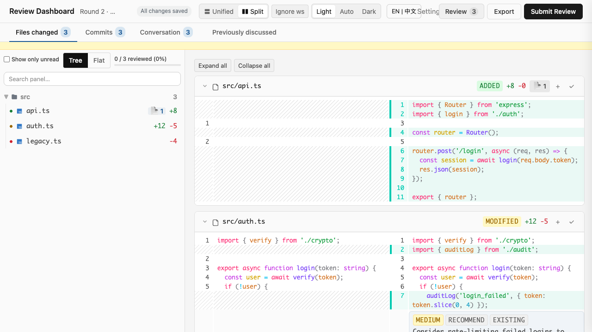

*Skip-to-content link at the top of every page. Sidebar tabs have proper `role="tablist"` / `role="tab"` ARIA semantics. Auto-save indicator has `role="status"` so screen readers announce save state. All modals trap focus and close on Escape.*

### Sidebar review progress indicator

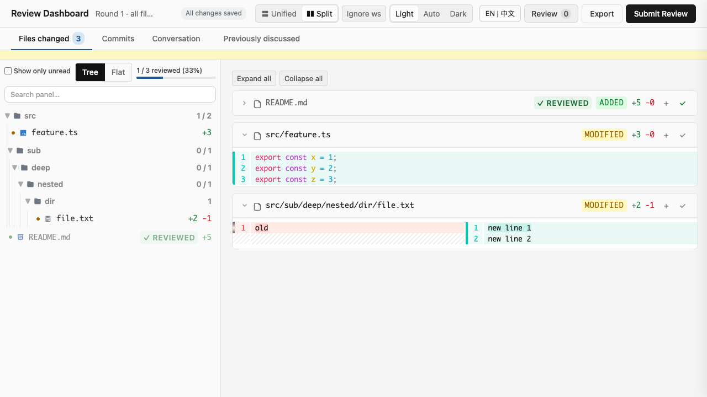

*Live counter at the top of the sidebar — "X / Y reviewed (Z%)" with a subtle progress bar — so you can see at a glance how much of the diff you've worked through. Updates the moment you click the read button on a file card.*

### Filter to unread files only

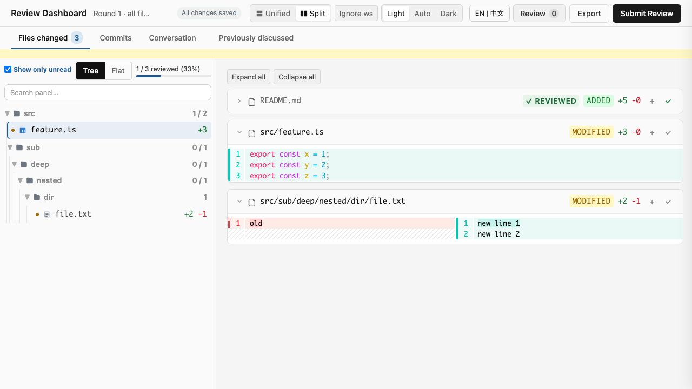

*Toggle the "Show only unread" chip in the sidebar header to hide files you've already marked as reviewed. State persists across reloads. Mirrors GitLab MR's "Hide reviewed" toggle.*

### Recent searches dropdown


*Focus the in-diff search bar (`Ctrl+F` / `Cmd+F`) to see your last 5 searches as a dropdown. Click any recent search to re-run it. State persists across reloads.*

### Smart search-history commit

*Search history now debounces intermediate keystrokes (300ms quiet period) and only commits your final query on Enter — no more stale "f", "fn", "fun" entries cluttering the recent-searches dropdown. Mirrors GitHub's `Cmd+K` palette and VS Code's search history.*

### Clear recent searches in one click

*Click "Clear" in the Recent Searches dropdown header to empty your search history instantly. Mirrors GitHub's `Cmd+K` → "Clear all" and VS Code's search history Clear button. Toast confirms the action. Pending debounced commits are cancelled so the dropdown stays empty.*

### Settings panel (centralized preferences)

*Click the ⚙ button in the header to open a centralized settings panel with 4 sections: Appearance (theme: light/auto/dark + diff virtualization toggle), Layout (unified/split), Search (history max), and Language (English / Chinese). Toolbar toggles still work as quick shortcuts; the settings panel is the canonical view for full control. Includes a Reset-to-defaults button.*

### Diff virtualization for 1000+ line files

*IntersectionObserver-based hunk virtualization. Only visible hunks render fully; off-screen hunks collapse to placeholders. Smooth scroll even on 5000+ line files. Toggle in settings (Appearance section) — OFF renders all hunks eagerly. Mirrors GitHub Turbo Frames / VS Code virtualized editor / Phabricator chunked diffs.*

### Bulk mark sidebar files as reviewed

*Each file card in the sidebar has a checkbox. Check the files you've reviewed, then click "Mark selected as reviewed" to mark them all in one action. The review progress counter (X/Y reviewed) updates immediately. Mirrors GitHub PR file tree multi-select.*

### Per-finding delete from history

*Each entry in the Recent Searches dropdown has a × button to remove that single entry without clearing all your history. Mirrors GitHub per-PR hide / VS Code per-file delete / Chrome per-entry delete from history.*

### Bulk delete in Conversation tab

*Each finding card in the Conversation tab now has a checkbox. Check the findings you want to remove, then click "Delete selected" to remove them all in one action. The active tab and filter are preserved. Mirrors GitHub PR comments multi-select / VS Code problems panel multi-select.*

### IME-safe search

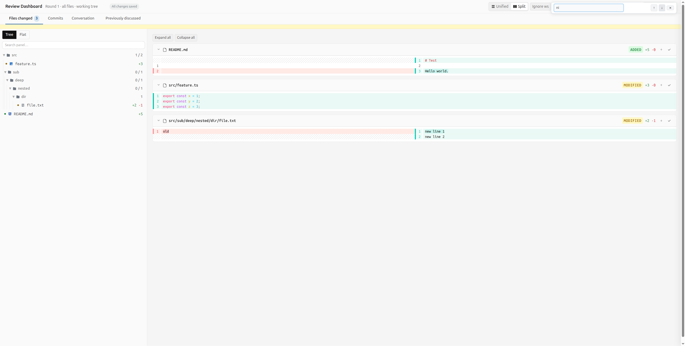

*All five search inputs (Files, Conversation, Previously discussed, In-diff, Cmd+P palette) work correctly while an Input Method Editor is composing characters. Press `Ctrl+F` / `Cmd+F` and type Chinese without losing keystrokes.*

### Keyboard shortcuts at a glance

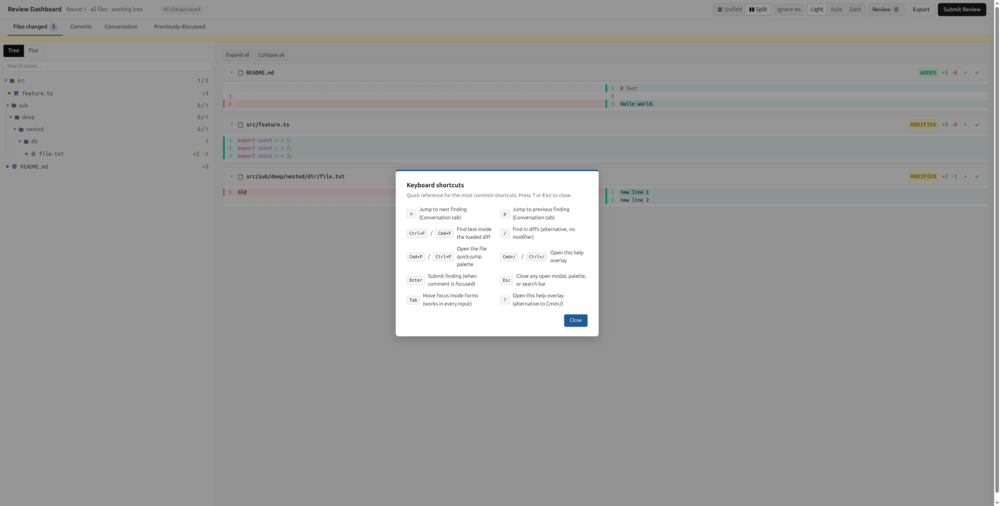

*Press `Cmd+/` (or `Ctrl+/`) to open the keyboard shortcuts overlay. 10 of the most common shortcuts in a 2-column grid.*

---

## What you can do with it

**Browse a diff in your browser.** All your changes (committed + uncommitted) are rendered in a single page. Unchanged regions are collapsed by default — click to expand. Files you haven't touched yet are dimmed so you can see at a glance what changed.

**Add findings.** Click a line number, type a comment, pick a category (bug / style / performance / question / recommendation), pick a severity (high / medium / low), and you're done. The finding is saved to a state file. You can also add file-level findings (not tied to a specific line) for general feedback.

**Comment threads.** Each finding can have multiple comments — useful when you and the agent iterate on a fix. Findings carry state: open / resolved / stale (auto-marked if the line it points to changes between rounds).

**Multi-round review.** When you submit a round, the agent applies its fixes, and you start a new round on top of those. Findings from previous rounds stay available via a dedicated "Previously discussed" tab — you can see what was discussed in round 1 when you're reviewing round 4.

**AI agent auto-apply.** The agent reads your findings, plans the fixes, applies them, and verifies. You can iterate within a single round: submit, the agent applies, you review the diff and add more findings if needed.

**Worktree auto-detection.** If you're working in a git worktree, the tool figures out which worktree you're in. No need to pass `--worktree` flags.

---

## Features

### Reading diffs

- **Foldable unchanged regions** — long diffs become scannable
- **Files-changed count** in the sidebar — see scope at a glance
- **Visual diff for line-level and file-level** — both supported
- **Diff range banner** — if the range changes mid-session (e.g., new uncommitted file), a yellow banner appears
- **Ignore whitespace changes** *(added R16)* — toggle in the toolbar collapses consecutive whitespace and trims trailing space per line, so pure reformatting (tab↔space, indent width) disappears from the diff. Stays on across reloads
- **Expand all / Collapse all** *(added R16)* — two buttons at the top of the diff panel flip every file's `expandUnchanged` setting at once. Useful for quickly skimming a 30-file diff vs. reviewing it line-by-line

### Adding findings

- **Click any line number** to start a finding on that line
- **Pick category** — bug / style / performance / question / recommendation
- **Pick severity** — high / medium / low
- **Add file-level findings** for general feedback (not tied to a line)
- **★ Pin findings** *(added R12)* — star any finding to mark it for revisit in the next round. A "★ Pinned" filter chip and a "★N" badge on the Conversation tab show all your starred findings at a glance
- **React with emoji** *(added R12)* — 👍 👎 😄 ❤️ 🎉 👀 on any finding. One click vs typing "lgtm". Click the same emoji again to remove your reaction

### Reviewing and iterating

- **`n` / `p` keys** *(added R12)* — jump to next/previous finding without scrolling. Works when your cursor isn't in a text field
- **In-diff search** *(added R13)* — `Ctrl+F` (or `Cmd+F` on Mac) opens a search bar to find any text in the loaded diff. Enter jumps to next match, Shift+Enter to previous
- **★ Sort findings** *(added R14)* — dropdown to sort by Newest / Oldest / Severity (high → low) / File path (A-Z)
- **Filter Previously-discussed by round** *(added R14)* — when reviewing 5+ rounds, filter the history tab by round number
- **★ Cmd+P file jumper** *(added R15)* — VS Code-style quick-open palette. Type a filename to jump directly to it
- **Copy finding as Markdown** *(added R16)* — "Copy as MD" button on each finding drops a self-contained Markdown snippet (round tag, file:line permalink, comment, audit count, reactions) onto your clipboard. Paste it straight into a PR comment or chat
- **IME-safe search** *(added R17)* — all five search inputs (Files tab, Conversation tab, Previously discussed, In-diff, Cmd+P palette) work correctly while an Input Method Editor is composing characters. Chinese pinyin, Japanese romaji, etc. commit without losing keystrokes or snapping back to partial IME buffers
- **Cmd+/ help overlay** *(added R17)* — press `Cmd+/` (Mac) or `Ctrl+/` (other) to open a 2-column shortcut grid with the 10 most common shortcuts. Press `?` or `Escape` to close
- **Search history debounce** *(added R21)* — typing into the in-diff search bar no longer floods your recent-searches with every intermediate keystroke. 300ms quiet-period debounce + Enter-immediate commit. Mirrors GitHub / VS Code behavior
- **Clear recent searches** *(added R22)* — "Clear" button in the Recent Searches dropdown header empties your search history in one click. Toast confirms the action. Mirrors GitHub / VS Code / Chrome
- **Bulk delete recent searches** *(added R23)* — per-item checkboxes in the Recent Searches dropdown let you multi-select and remove just the entries you want (without nuking everything). Mirrors Chrome history / VS Code search multi-select delete
- **Diff virtualization for 1000+ line files** *(added R23)* — IntersectionObserver-based hunk virtualization. Only visible hunks render fully; off-screen hunks collapse to placeholders. Smooth scroll even on 5000+ line files. Mirrors GitHub Turbo Frames / VS Code virtualized editor / Phabricator chunked diffs
- **Settings panel** *(added R21)* — click the ⚙ button in the header for a centralized preferences panel (theme / layout / search / language / reset-to-defaults). Toolbar controls stay as quick shortcuts; both paths share the same handlers
- **Diff virtualization toggle** *(added R25)* — settings panel toggle (Appearance section) to enable/disable IntersectionObserver-based hunk virtualization for users who want eager rendering on small diffs
- **Bulk mark sidebar files as reviewed** *(added R25)* — per-file checkboxes in the sidebar + "Mark selected as reviewed" bulk button. Multi-select pattern matching GitHub PR file tree
- **Per-finding delete from history** *(added R26)* — × button on each Recent Searches dropdown entry to remove a single entry without clearing all history. Mirrors GitHub per-PR hide / VS Code per-file delete
- **Bulk delete in Conversation tab** *(added R26)* — per-finding checkboxes in the Conversation tab + "Delete selected" bulk button. Mirrors GitHub PR comments multi-select / VS Code problems panel

### Resolving findings

- **★ Resolve-with-reason modal** *(added R13)* — when resolving a finding, you can pick a quick-reason (Fixed / False positive / Out of scope / Wontfix) or type your own. The reason is preserved for future reference
- **Mark as wontfix / out-of-scope** *(added R13)* — distinct from plain Resolve. Use this for findings you agree with but don't want fixed (known issue, future work, etc.)
- **Comments audit trail** *(added R15)* — every edit to a finding preserves the prior version. The conversation thread shows "X edits" with the before/after history

### Submitting

- **Submit confirm modal** *(added R15)* — before final submit, a modal shows "Review N findings before submitting" to prevent accidental submits
- **Round notes inside submit modal** *(added R17)* — the round notes textarea now lives inside the Submit Review modal. You write the summary at the moment you're ready to send, with auto-save to the same draft. The sidebar notes section is gone
- **Auto-save indicator** *(added R14)* — "Saved 3s ago" appears in the header, updates in place. No more intrusive "Draft saved at 12:34:56" toasts

### Workflow

- **Multi-round review** — each submit is a round. Findings carry forward between rounds. Stale findings (anchored to a line that changed) are auto-marked
- **Auto-apply agent** — the agent reads your findings, plans, applies, and verifies. Iteration within a round
- **Export** — save the review as a markdown report
- **Round notes** — global notes per round, auto-imported into the "Previously discussed" view

---

## How to install it

1. Install [OpenCode](https://opencode.ai) if you haven't
2. Install the plugin (see OpenCode plugin registry for the exact command):
   ```bash
   opencode plugin install @weekbin/opencode-review-dashboard
   ```
3. Open a project with git changes
4. Run `/diff-review-dashboard` in your OpenCode chat

That's it. The dashboard opens in your browser at `http://localhost:<port>`.

---

## How to use it

**A typical workflow:**

1. You make some code changes in your editor
2. You commit some, leave others uncommitted — that's fine
3. In OpenCode chat, you type `/diff-review-dashboard` and press Enter
4. Your browser opens to the review dashboard
5. You click line numbers to add findings, type comments, pick categories and severities
6. When you're done adding findings, you click "Submit Review" — confirm in the modal
7. The agent reads your findings, plans fixes, applies them
8. You reload the browser to see the agent's diff
9. You iterate: review the agent's changes, add more findings, or resolve what you liked
10. When you're fully satisfied with a round, you submit it; the findings carry forward to the next round

**Tips:**
- Use ★ Pinned for findings you want to revisit after the agent applies changes
- Use emoji reactions to give quick feedback without writing a full comment
- Use `n` / `p` keys to fly through findings without scrolling
- The "Previously discussed" tab accumulates history across rounds — use the round filter to focus on recent context

---

## Keyboard shortcuts

| Key | Action |
|---|---|
| `n` | Jump to next finding |
| `p` | Jump to previous finding |
| `Ctrl+F` / `Cmd+F` | Open in-diff search |
| `/` | Open in-diff search (alternative) |
| `Cmd+P` / `Ctrl+P` | Open file quick-jump palette |
| `Cmd+/` / `Ctrl+/` | Open the keyboard shortcuts overlay |
| `?` | Open the keyboard shortcuts overlay (alternative) |
| `Escape` | Close any open modal / overlay |
| `Enter` | Confirm default action in modals |
| `Tab` (when "Ignore ws" toggle focused) | Toggle whitespace-collapse on/off (use the toolbar button — no global shortcut; helps you review reformatted diffs without visual noise) |

---

## FAQ

**Q: Where is my review data stored?**
A: In a `state.json` file at the project root. Each round also exports a `round-NNN.json` and `round-NNN.md` for reference.

**Q: Can I review a PR that someone else opened?**
A: Yes — pass `--base=<branch>` (e.g., `--base=main` to review all changes since main). The dashboard shows that diff instead of your working tree.

**Q: What happens if my review gets interrupted (browser closed, computer dies)?**
A: Everything is auto-saved. The next time you open the dashboard, you pick up where you left off. If `state.json` ever gets corrupted, the tool preserves it as `state.json.corrupt-<timestamp>` and starts a fresh state — your data isn't lost.

**Q: Can I work in a git worktree?**
A: Yes. The tool auto-detects the worktree (the one with the most commits ahead of `origin/main`). You can also pass `--worktree=<name>` explicitly.

**Q: How do I see what was discussed in a previous round?**
A: Click the "Previously discussed" tab. Use the round filter dropdown to focus on specific rounds.

**Q: Can I un-resolve a finding?**
A: Yes — click the finding, change its status back to "open", and add a reason if you want.

**Q: Is there a keyboard shortcut to navigate between findings?**
A: Yes — `n` (next) and `p` (previous). The shortcuts work when your cursor isn't in a text field, so you can type `n` and `p` in comments without triggering nav.

---

## License

[MIT](LICENSE) (or whatever the project uses)

---

## Contributing

Bug reports and PRs welcome. See [issues](https://github.com/weekbin/opencode-review-dashboard/issues) for the current backlog.
