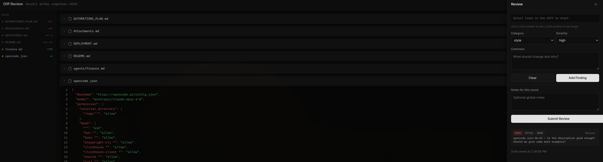

# opencode-review-dashboard

An [OpenCode](https://opencode.ai) plugin that adds a `/diff-review` command for browser-based code review powered by [@pierre/diffs](https://diffs.com).



## What it does

When you run `/diff-review` inside an OpenCode session, the plugin:

1. **Collects diffs** from your git working tree (or between a base branch and HEAD)
2. **Starts a local HTTP server** and opens a review UI in your browser
3. **Waits for you to review** — you annotate lines in the diff with findings (category, severity, comment)
4. **Returns structured results** to OpenCode when you submit, so the AI can propose a fix strategy

The idea is to give you a visual, interactive way to review code changes before asking the AI to act on them. Instead of describing problems in chat, you click on the exact lines, categorize the issue, and write a short comment. The AI then receives all your findings as structured data and can reason about fixes more precisely.

### Review flow

```
You run /diff-review
    → Plugin reads git diff
    → Browser opens with syntax-highlighted diffs
    → You click lines, add findings (bug/style/perf/question + severity + comment)
    → You hit "Submit Review"
    → Plugin returns findings to OpenCode
    → AI proposes a fix plan based on your annotations
```

### Multi-round reviews

Each session tracks review rounds. When you run `/diff-review` again in the same session, findings from previous rounds carry over. If a file was removed or the anchored code changed, old findings are automatically closed. This lets you do iterative review — submit findings, let the AI fix things, then review the new diff.

### State and exports

Review state is persisted to `.opencode/reviews/<session>/`. Each round produces:
- `state.json` — full session state with all findings across rounds
- `round-NNN.json` — snapshot of findings for that round
- `round-NNN.md` — markdown summary

Drafts are auto-saved as you work, so you can close the browser and reopen without losing progress.

---

## Installation

This plugin is distributed as the npm package [`opencode-review-dashboard`](https://github.com/weekbin/opencode-review-dashboard). The package ships a pre-built `dist/` directory, so no build step is required on the consumer side.

### Option 1 — install from GitHub (recommended, no publish required)

Add this to your `opencode.json` (either your global config or a per-project `.opencode/opencode.json`):

```json
{
  "plugin": ["github:weekbin/opencode-review-dashboard"]
}
```

OpenCode will clone the repo into its plugin directory and pick up `dist/plugin/index.mjs` via the `main` field in `package.json`.

### Option 2 — install from npm (when published)

```json
{
  "plugin": ["opencode-review-dashboard"]
}
```

### Option 3 — install from a local clone (best for hacking on the plugin itself)

If you have this repo cloned at `~/Projects/opencode-review-dashboard`, point OpenCode at it directly:

```json
{
  "plugin": ["file:~/Projects/opencode-review-dashboard"]
}
```

Relative paths work too:

```json
{
  "plugin": ["file:../opencode-review-dashboard"]
}
```

Use this when you want to edit the plugin code and see changes after a rebuild (`bun run build`) + OpenCode restart.

### After install

Restart OpenCode. The `/diff-review` slash command will be registered.

---

## Usage

Review your working tree changes:

```
/diff-review
```

Review against a specific branch:

```
/diff-review --base origin/main
```

Filter to specific files (comma-separated, no spaces):

```
/diff-review --files src/foo.ts,src/bar.ts
```

Combine flags:

```
/diff-review --base origin/main --files src/foo.ts
```

When you submit a review, the plugin returns the findings as a tool result. The AI in your OpenCode session can then read those findings and propose a fix plan. Nothing happens automatically — submit the review, then ask the AI to act on the findings in chat.

### Tips

- The browser tab is just `http://127.0.0.1:<random-port>/` — bookmarking the URL only works for the current round (the server is a one-shot per `/diff-review` invocation).
- Findings are anchored to file + line + a code snippet. If the surrounding code changes between rounds, the finding auto-closes (shown in the UI as "stale").
- Close the browser tab to abandon a review without submitting.

---

## Review UI

The browser UI has three main areas:

- **Sidebar** (left) — lists all changed files with add/delete stats. Click a file to scroll to it.
- **Diff cards** (center) — syntax-highlighted diffs for each file. Click line numbers to select a range. Files can be collapsed and marked as read.
- **Review drawer** (right) — opens when you select lines. Pick a category (`bug`, `style`, `perf`, `question`), severity (`high`, `medium`, `low`), write a comment, and click "Add Finding".

Findings from prior rounds appear with a "Resolve" button. The drawer also has a notes field for general observations and the submit button.

Light/dark mode follows your system preference, or you can toggle it manually.

---

## Development

This repo is a fork of [`oorestisime/opencode-diffs`](https://github.com/oorestisime/opencode-diffs) with workspace isolation fixes. If you're hacking on the plugin itself:

```bash
bun install
bun run build        # build plugin + UI (writes to dist/)
bun run lint         # lint with oxlint
bun run format       # format with oxfmt
bun run typecheck    # type-check with tsc
bun run check        # all three checks
```

To test a local change, use the `file:` install above, then run `bun run build` and restart OpenCode.

---

## License

MIT
