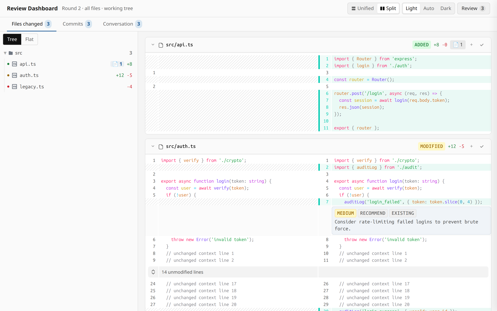
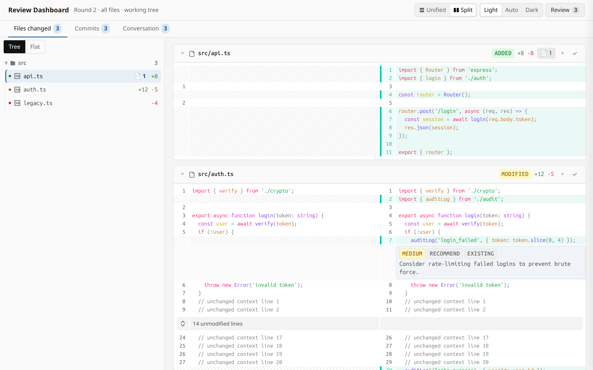
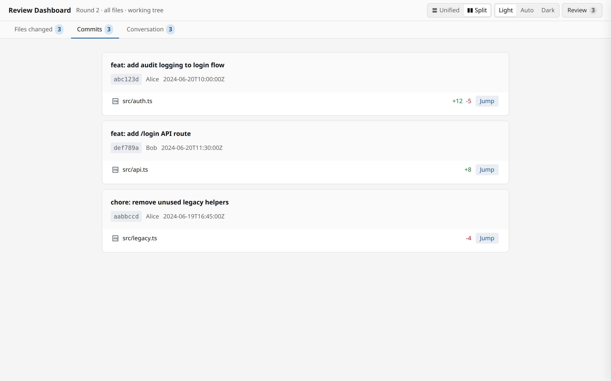
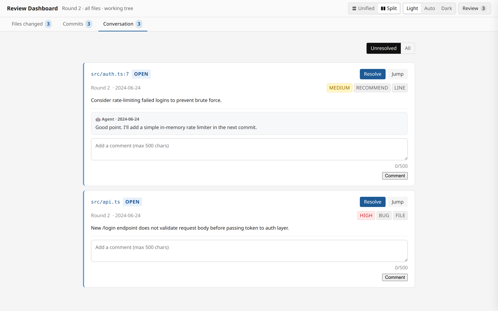
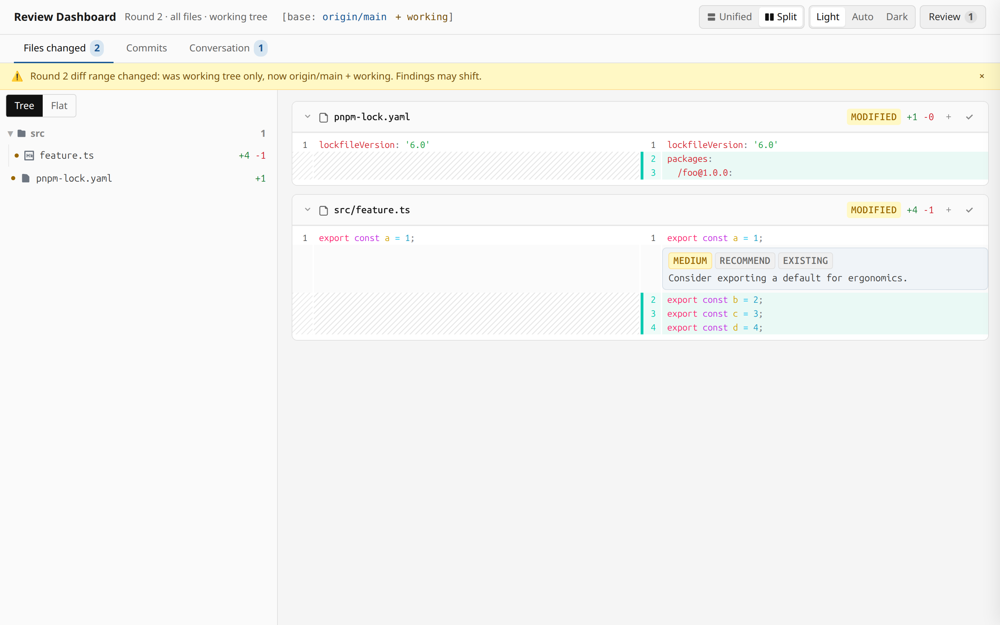
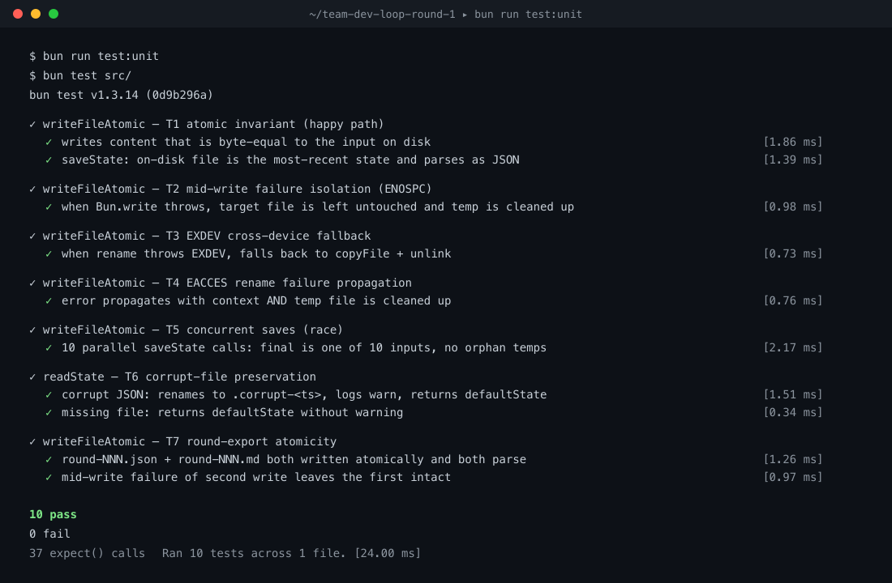

# @weekbin/opencode-review-dashboard

[English](README.md) | 中文

一个 [OpenCode](https://opencode.ai) 插件，提供 `/diff-review-dashboard` 斜杠命令，用于在浏览器中进行代码审查，基于 [@pierre/diffs](https://diffs.com) 渲染 diff。

命令名：`diff-review-dashboard`（工具名：`diff_review_dashboard`）。

## 截图

### Diff 审查（未改动区域可折叠展开）



### 添加 finding（行级或文件级）



### Commits 面板



### Conversation 面板（支持评论）



### Diff 范围（含未提交文件）



## 功能清单

本节列出所有已交付的能力，方便把 README 当作产品 spec 来读。每个条目给出用户能感知到的保证、证据（测试或截图）、以及如何验证。

### 崩溃安全的审查状态（原子写入）

即使断电、编辑器中途关闭，或 `state.json` 文件损坏，你的审查历史也不会丢。所有对 `state.json`、`round-NNN.json`、`round-NNN.md` 的写入都走同一个原子辅助函数（`src/state-store.ts` 里的 `writeFileAtomic`），它在同一文件系统下用 POSIX 原子语义的"临时文件 + rename"实现：读者要么看到旧内容，要么看到新内容，绝不会看到半截写入。跨设备场景回退到 `copyFile + unlink`。如果临时写入中途失败（ENOSPC、EIO 等），目标文件保持不变，残留的 `.tmp.*` 也会被清理。如果磁盘上的 `state.json` 无法解析，会被重命名为 `state.json.corrupt-<timestamp>`（保留数据用于手动恢复），TUI 中打印一条 warning，然后启动一个全新的 state。



单元测试覆盖的 7 个场景（T1 happy path · T2 ENOSPC 隔离 · T3 EXDEV 回退 · T4 EACCES 透传 · T5 并发写入 · T6 损坏文件保留 · T7 round-export 原子性）通过下面的命令运行：

```bash
bun run test:unit
```

你不需要做任何额外配置：每次 `/diff-review-dashboard` 都会走原子写入路径。唯一的用户可见副作用：如果你在 TUI 看到 `[diff-review-dashboard] state.json at … was unreadable; preserved as …`，说明历史被保留到了 `.corrupt-<ts>` 文件里，可以先尝试手工恢复再继续。

### 其他已交付能力

- **浏览器审查 UI** — 文件树、语法高亮 diff（可折叠未改动区域）、finding 抽屉（分类/等级/评论）。见 [审查界面](#审查界面)。
- **Diff 范围 + 跨轮 drift banner** — 报告实际审查的 diff 范围；跨轮范围变化时显示黄色 banner。见 [Diff 范围](#diff-范围)。
- **多轮审查** — finding 在轮次间保留，锚点代码变更时自动标记为 stale。
- **"Previously discussed" 面板（第 4 个 sidebar tab）** — 独立 tab，专门展示历史轮次上下文：每轮的 `notes`（从已存在的 `round-NNN.md` 导出读取）、每轮的 finding（open / resolved / stale）以及每条 finding 的完整评论线程。让你在决定这一轮怎么动之前能快速 re-orient 到对话历史，不必开终端或在 Conversation tab 翻 30+ 条记录。与 Conversation tab 互补（Conversation 关注当前轮）。
- **自动应用工作流** — Agent 先统一规划，再一次性应用可操作 finding，然后重跑 review 确认。
- **Worktree 自动检测** — 未传 `--worktree` 时自动选取 ahead-of-`origin/main` 最多的 worktree。
- **★ Pinned findings（星标回看列表）** — 点 finding 卡片上的 ★ 即把这条 finding 标记为下轮回看目标；新增 `★ Pinned (N)` 过滤 chip 以及 Conversation tab 头部 `★N` 徽章，一眼看到所有 starred 的 finding。`manually_pinned` 字段会被 agent 的 auto-apply 循环识别，因此被星标的 finding 不会因为 stale auto-close 被静默吞掉。这是 reviewer 侧的 revisit list，与 GitHub admin-only 且 repo 级别（最多 3 个）的 "Pinned Issue" 完全不同。
- **Emoji reactions on findings（emoji 反应）** — 每条 finding 卡片下方新增 6 个 emoji 按钮（👍 👎 😄 ❤️ 🎉 👀）。点击 → 加上自己的反应（1 击 vs ~30 秒打字 "lgtm"）；再点同一个 emoji → 移除反应（幂等 toggle）。已反应的 emoji 渲染为高亮 + 计数 pill。
- **`n` / `p` 键盘在 finding 间跳转** — 焦点不在评论 textarea 时按 `n` 跳到下一条 finding，按 `p` 跳上一条（到两端自动 wrap）；复用 R11 的 1.5s flash highlight。Conversation tab 激活时右下角出现提示 `Press n / p to navigate findings`；textarea/input/contentEditable 获得焦点时自动隐藏，避免输入 'n' 或 'p' 误触发跳转。
- **★ Resolve-with-reason 弹窗** — 点 Resolve 按钮会先弹「Review N findings before submitting」弹窗，可选 4 个 quick-reason 预设（Fixed / False positive / Out of scope / Wontfix）或自填理由（≤200 字）；确认后 POST 带 reason 到 `/api/review/${id}/resolve`，服务器把 `resolve_reason + manually_resolved + resolved_at` 原子写入 `state.json`。R9 的 Force Reopen 已有 reason 流程，Resolve 这条补上对称的可追溯性。Closes GitHub PR Submit-review + Gerrit Submit Patch Set confirm gap。
- **Mark as wontfix / out-of-scope** — 新增 Resolution Kind 维度：4 个 radio 选项（`wontfix` / `out_of_scope` / `false_positive` / `duplicate`）加可选 reason。Finding 的 `status` 仍为 `"resolved"`（不破坏现有 filter chip），新增 `resolution_kind: "wontfix" | ...` 字段。Agent prompt 加 `### Resolution-kind findings (R13)` honor directive 防止 agent 把 wontfix 的 finding 当作未修重新打。Closes Phabricator "Abandon" + Jira "Won't Fix" + Linear "Canceled" gap。
- **★ In-diff search（`Ctrl+F` / `/`）** — 焦点不在 textarea / input 时按 `Ctrl+F` / `Cmd+F` / `/` 打开顶部固定的搜索覆盖层，capture-phase `preventDefault` 抢在浏览器原生 find 之前。覆盖层输入框对 diff 行做 substring 大小写不敏感过滤；`Enter` / `Shift+Enter` / `F3` / `Shift+F3` 跳到下一个 / 上一个匹配，1.5s flash highlight 复用 R11 的 `flashFindingPermaHighlight`；`Escape` 关闭并清空 `<mark>` 高亮；焦点守卫（`isTextInputFocused`）让 textarea / input 焦点时把控制权让回浏览器原生。Closes diff.nvim + Gerrit + GitHub PR file finder gap。
- **★ Sort findings 下拉**（Conversation 工具栏）— 4 个排序选项：Newest first / Oldest first / Severity high→low / File path A-Z。默认「Newest first」保留现有 chronological；选择持久化到 `localStorage state.sortFindingsBy`（reload 后保留），无效值自动回退到「newest」。sort reducer 纯客户端，命中后与 `filterByQuery`（R8 in-tab search）合成，不触发 network。Closes GitHub PR + Linear + Phabricator 排序 gap。
- **Filter Previously-discussed by round** — Previously-discussed tab 顶部新增 `<select class="filter-previously-by-round">` 下拉，选项从 `state.findings` 的唯一 round number 动态构建（默认「All rounds」）。Session-scoped 状态（in-memory，不持久化），与 R8 in-tab search 合成（filter 不重置搜索）。5+ round 的 session 不用 scroll 30+ 个旧 finding。Closes GitHub PR "Hide older reviews" + GitLab MR activity filter gap。
- **Draft auto-save indicator**（持久「Saved Xs ago」header 指示器）— 替代侵入式的「Draft saved at HH:MM:SS」toast。`Draft.lastSavedAt?: number`（可选项，旧 `state.json` 默认 0）由 `scheduleSave` 在 `await saveState()` 之后原子写入；header 顶部 fixed 显示「Saved Xs ago」，`setInterval(5000)` 刷新；60s 不活动切到「All changes saved」。`requestAnimationFrame` coalesce 避免快速保存时闪烁。Closes Google Docs + Notion + VS Code Modified-dot pattern。
- **★ Cmd+P 文件跳转面板**（VS Code 风格 quick-open）— 全局 `Cmd+P` / `Ctrl+P` 捕获，capture-phase `preventDefault`，焦点守卫（`isTextInputFocused`）让 textarea / input 焦点时把控制权让回浏览器。面板输入框对 `getOrderedFiles()` 做 substring 大小写不敏感过滤；`Enter` / 点击 / 上下方向键导航；选中后跳到文件 + 1.5s flash highlight 复用 R11 的 `flashFindingPermaHighlight`；`Escape` 关闭。Closes VS Code Cmd+P + GitHub PR t file finder + Sublime + GitKraken gap。
- **Submit 确认弹窗**（提交前防止误操作）— 点 Submit 按钮时先弹「Review N findings before submitting」弹窗（finding 数从 `state.existing_findings + state.fresh` 实时计算），`Enter` 默认确认 / `Escape` / 点击外部 / Cancel 都关闭。复用 R13 的 `showReopenReasonModal` + `showMarkAsWontfixModal` 弹窗 pattern（`modal-overlay` + dialog）。Closes GitHub Submit-review + Gerrit Submit Patch Set confirm gap。
- **Comments audit trail（编辑前版本留存）** — R10 的 Edit-in-place 流程会保留前一个版本作为 `FindingAuditRow { before, after, at, by }`，存到新增的 `Finding.audit_log?: FindingAuditRow[]`（可选项，旧 `state.json` 默认 `[]`）。`renderConversationPanel` 渲染 audit 行 + 折叠 disclosure（"X edits" 摘要）。Agent prompt 加 `### Audit trail (R15)` honor directive 防止 agent 重做用户的旧版编辑。Closes Phabricator Differential audit log gap。

---

## Diff 范围

每一轮 `/diff-review-dashboard` 都会在响应和 UI header 中报告**实际的 diff 范围**：

- **默认**：`HEAD vs origin/main + working tree`（合并两者）。未提交的文件在 sidebar 中以**灰色**显示，文件卡片头部有 **uncommitted** 徽章，便于和已提交改动区分。
- **覆盖**：传入 `--base=<ref>`（如 `--base=HEAD~3`）可只查看 commit 范围，不包含工作区。
- **跨轮 drift**：当 diff 范围在轮次之间变化时（例如 round 2 新增了 round 1 没有的 uncommitted 文件），UI 顶部出现**非阻塞的黄色 banner**，分别显示上一轮和当前的 diff 范围。审查不中断，可点击 × 关闭。

此修复针对 [issue #4](https://github.com/weekbin/opencode-review-dashboard/issues/4)。之前如果存在 uncommitted 文件，工具会静默丢弃整个 commit 栈的 diff 并错误地返回 "no findings"，而实际是有内容需要审查。

---

## 功能

在 OpenCode 会话中运行 `/diff-review-dashboard` 后，插件会：

1. **收集 diff**：从 git 工作区、基准分支或指定 worktree 读取变更。
2. **启动本地 HTTP 服务器**，并在浏览器中打开审查界面。URL 也会打印到 TUI，方便手动复制。
3. **进行审查**：点击行号或文件卡片上的 + 按钮，添加 finding（分类、等级、评论）。
4. **提交后返回结构化 JSON**，供 OpenCode 处理。
5. **Agent 自动应用**可操作的 finding（见 [自动应用规则](#自动应用规则)）。

### 审查流程

```
运行 /diff-review-dashboard
    → 插件读取 git diff
    → 在 TUI 打印 review URL
    → 浏览器打开语法高亮的 diff
    → 点击行/文件添加 finding
    → 点击 "Submit Review"
    → 插件返回 JSON：{ round, open_count, by_severity, by_category, notes, findings[], artifacts }
    → Agent 自动应用可操作的 finding，然后重新运行 /diff-review-dashboard
```

### 自动应用规则

斜杠命令模板要求 Agent **不要询问用户**，提交后直接处理：

- 按等级排序：high → medium → low。
- 跳过 `category: question`（仅澄清问题）。
- **先统一规划**：Agent 先读取所有相关文件，再设计一个统一的修复计划。
- 一次性应用全部修改，然后重新运行 `/diff-review-dashboard` 确认。
- 如果 `open_count == 0` 或没有可操作 finding，输出 `Round N: no actionable items, closing out.` 并结束。

### 自动回复的语言匹配

Agent 的 `add_review_comment` 回复和 Post-Apply Trace 评论会跟随你 finding 的语言：

- **CJK 比例 > 30%** → 用中文回复。
- **CJK 比例 < 10%** → 用英文回复。
- **混合（10–30% CJK）** → 默认英文，除非你在同一轮里 3 条以上都明显用中文。
- **空 / 纯空白输入** → 默认英文（保留原行为）。

启发式正则基于 CJK 字符范围 `[\u4e00-\u9fff\uac00-\ud7af\u3040-\u309f\u30a0-\u30ff]`（汉字 + 日文汉字/平假名/片假名 + 韩文 Hangul），由插件的 `detectLanguage()` 辅助函数在 `src/index.ts` 内执行。Agent prompt 里有一节专门的 "### Language Matching" 指示模型镜像用户评论的语言。代码、文件路径、工具标识符始终保持原样，不受回复语言影响。

**手工验证**（超出 e2e harness 范围——需要真实的 OpenCode 会话）：发 1 条中文 finding，比如"这个 auth middleware 应该用 jwt.verify"，提交本轮，触发 auto-apply 循环，确认 Agent 的 `add_review_comment` 回复是中文。下一轮的中文回复会自动出现在"Previously discussed"面板中。

### 多轮审查

每个会话会跟踪 review 轮次。再次运行 `/diff-review-dashboard` 时，之前轮次的 finding 会保留；如果文件被删除或锚定代码发生变化，旧 finding 会自动标记为 `stale`（过期）。

第 4 个 sidebar tab "Previously discussed" 提供同会话内每个历史轮次的可一眼看完的总览：每轮的 `notes`（从 `round-NNN.md` 读取）、每轮的 finding（open / resolved / stale）、以及每条 finding 的完整评论线程（按时间顺序排列的 user / agent 回复）。数据从已存在的 `state.findings[]` 数组和 `round-NNN.md` 导出读取——没有新 state 文件、没有新 payload 字段、没有新依赖。当前轮次刻意不包含（用 Conversation tab 看当前轮）。如果当前在第 1 轮，tab 会显示"第 1 轮——还没有历史"空状态。

### 状态与导出

审查状态持久化到 `.opencode/reviews/<session>/`：

- `state.json` — 完整会话状态
- `round-NNN.json` — 单轮 finding 快照
- `round-NNN.md` — Markdown 摘要

草稿会自动保存，关闭浏览器后重新打开不会丢失进度。审查状态文件采用原子写入（临时文件 + rename），即便崩溃或断电也不会留下半截的 `state.json`。如果发现 `state.json` 不可读，会先保留为 `state.json.corrupt-<timestamp>` 再启动新 state；TUI 中会打印 warning，可在 `.corrupt-*` 文件里尝试手工恢复数据。

---

## 安装

将插件添加到你的 `opencode.json`（全局或项目级 `.opencode/opencode.json`）：

```json
{
  "plugin": ["@weekbin/opencode-review-dashboard"]
}
```

重启 OpenCode，`/diff-review-dashboard` 命令即可使用。

本地开发时，可使用 `file:/path/to/this/repo` 替代。

---

## 使用

查看工作区变更：

```
/diff-review-dashboard
```

对比指定分支：

```
/diff-review-dashboard --base origin/main
```

对比指定提交或范围：

```
/diff-review-dashboard --base HEAD~1
/diff-review-dashboard --base HEAD~3
```

指定 worktree（默认自动检测）：

```
/diff-review-dashboard --worktree /path/to/worktree
```

只审查指定文件（逗号分隔，无空格）：

```
/diff-review-dashboard --files src/foo.ts,src/bar.ts
```

组合使用：

```
/diff-review-dashboard --base origin/main --files src/foo.ts
```

启动后，TUI 会打印 review URL：

```
[diff-review-dashboard] review URL: http://127.0.0.1:55006/review/review_abc?token=...
```

浏览器会自动打开；如果失败，可从 TUI 复制 URL。

### worktree 解析规则

解析优先级：

1. `--worktree <path>` 显式指定
2. `context.worktree`（当前 OpenCode 会话所在的 worktree）
3. `context.directory`（会话主目录 / cwd）

第一个能解析到有效 git toplevel 的路径会被使用。同一会话的所有轮次都会固定使用该路径，确保 finding 持久化。

未指定 `--worktree` 时的自动检测：如果你在主 checkout 中，插件会列出所有 worktree，选择 ahead-of-`origin/main` 提交数最多的一个；如果你已经在某个 worktree 中，则固定使用当前 worktree。

### 提示

- 浏览器标签页 URL 是单次有效的，刷新页面无法保留。
- finding 锚定在文件 + 行号 + 代码片段上；如果后续代码变化，finding 会自动过期。
- 提交后浏览器标签页会自动关闭。

---

## 审查界面

浏览器界面分为四个区域（左侧 sidebar 含 4 个 tab）：

- **左侧边栏**（可拖动调整宽度，宽度会保存到 localStorage）：
  - **Files Changed** — 列出所有变更文件，支持 tree/flat 切换。文件级 finding 会显示 📄 徽章。未跟踪文件以 `status: "added"` 显示，并带"uncommitted" 徽章。
  - **Commits** — 每个文件涉及的提交列表，含短 SHA 和提交信息。
  - **Conversation** — 所有 finding（行级/文件级），含状态徽章和按 finding 回复的评论；支持 Resolve、Remove、Reopen、Jump 操作；点 ★ 星标可把 finding 加入回看列表；下方 6 个 emoji 按钮可一键反馈；过滤 chip：`Unresolved | Resolved | All | ★ Pinned (N) | 😀 Reacted (N)`；按 `n` / `p` 在 finding 卡片间跳转。
  - **Previously discussed** — 历史轮次上下文：每轮的 `notes`、每轮的 finding（open / resolved / stale）以及每条 finding 的完整评论线程。不含当前轮。第 1 轮显示空状态。
- **中间 diff 卡片** — 语法高亮 diff。点击行号选择范围，点击文件卡片上的 + 按钮添加文件级 finding。大段未改动代码默认折叠，点击展开按钮每次显示 20 行。
- **Notes 表面**（diff 卡片上方的可折叠区域）— 本轮整体 notes 永远在这里可见，审阅时随手写即可，不必打开抽屉。notes 会被下一轮的 "Previously discussed" 面板读取。点击 "Round notes" 标题可折叠，需要更多垂直空间时收起即可。
- **Review 抽屉**（弹层）— 仅含 finding 字段：选择分类（`bug`/`style`/`perf`/`question`/`recommend`）和等级（`high`/`medium`/`low`），填写评论后点击 "Add Finding"。抽屉里不含 notes，也不含 Submit 按钮——保持单一职责。
- **顶部 Header 操作** — `Submit Review` 永远在页面 header，是唯一提交入口；terminal 动作绝不藏在任何面板里。旁边是布局（unified / split）和主题（light / auto / dark）切换。"Review" 切换按钮实时显示 finding 数量。

界面会跟随系统亮/暗模式，也可手动切换。

---

## 开发

项目最初 fork 自 [`oorestisime/opencode-diffs`](https://github.com/oorestisime/opencode-diffs)，已大幅重写，新增了 worktree 自动检测、文件级 finding、Commits/Conversation 面板、finding 评论、可拖动侧边栏、diff 折叠、自动应用工作流等。

### 脚本

| 脚本 | 作用 |
|---|---|
| `bun run build` | 打包插件（`tsdown` → `dist/plugin/index.mjs`）和 UI（`dist/ui/`），并复制 `src/ui/review.html`。 |
| `bun run prepare` | `bun install` 时自动运行，调用 `build`。 |
| `bun run lint` | 使用 [oxlint](https://oxc.rs/docs/guide/usage/linter) 检查 `src/`。 |
| `bun run format` | 使用 [oxfmt](https://oxc.rs/docs/guide/usage/formatter) 格式化 `src/`。 |
| `bun run format:check` | 检查格式，不写入。 |
| `bun run typecheck` | 使用 `tsc --noEmit` 类型检查。 |
| `bun run check` | `format:check && lint && typecheck`。 |
| `bun run prepublishOnly` | `npm publish` 前自动运行 `check + build`。 |
| `bun run test:ui` | 端到端浏览器测试（Playwright MCP），覆盖 31 个 git 场景。 |

### 本地设置

```bash
bun install
bun run check        # format:check + lint + typecheck
bun run build        # 生成 dist/
```

---

## 许可证

MIT
